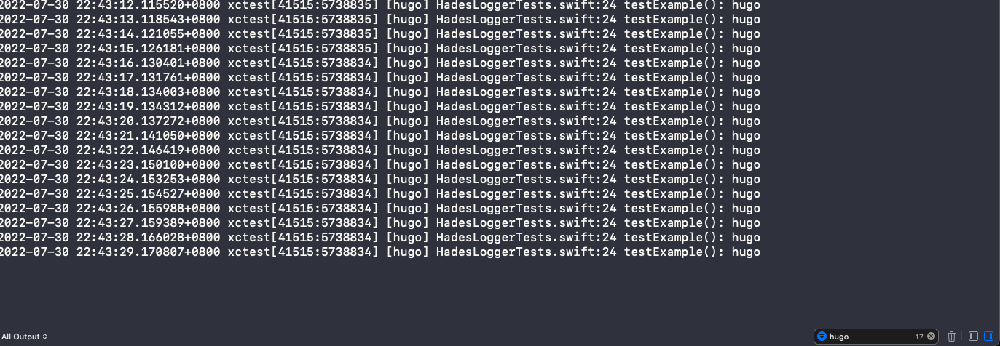
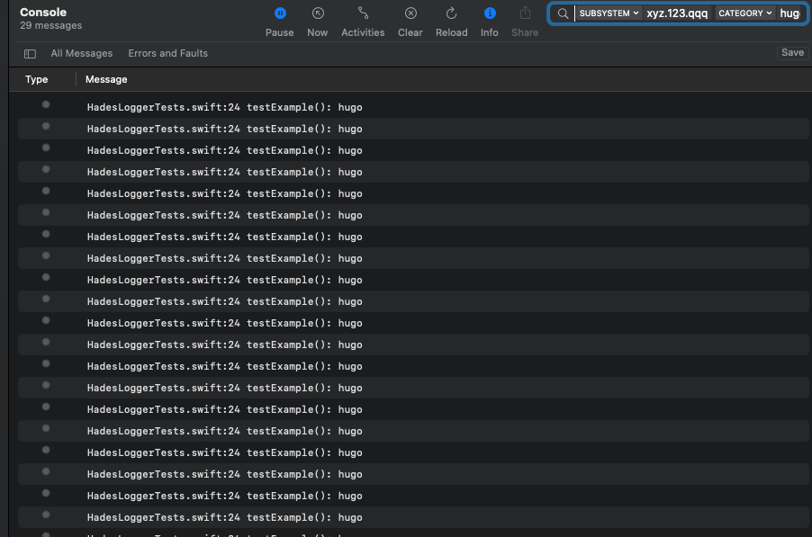
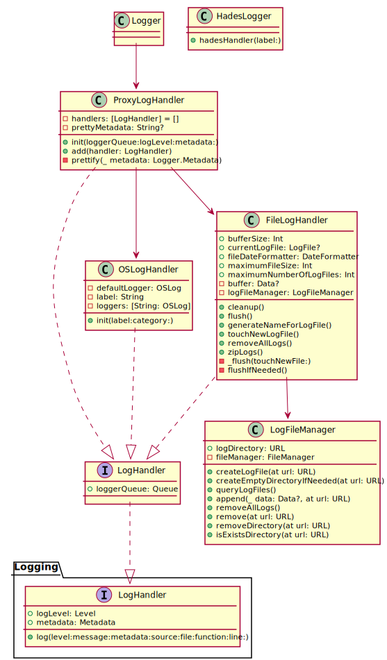

# hades-logger

A logging library for ios, with support for printing logs to console, and saving to file summaries. Provides in-app log viewing and log sharing functions.

## Features

- Easier to filter log in both cosole at bottom of `Xcode` and `Console.app`
- Easier to shre logs for writing logs into files

## How to use?

Initialize the log module.

```swift
  let label = "xyz.123.qqq"
  let handler = HadesLogger.hadesHandler(label: label)
  log = Logger(label: label, handler)
  log.logLevel = .debug
  LoggingSystem.bootstrapInternal() { _ in handler }
```

You can print your logs with these methods (`log.debug()`, `log.info()`...). It's useful to print logs with `category` of metadata when you want to debug code via logs. You can filter logs with `category` to focus logs you want.





```swift
log.debug("hugo", metadata: ["category": "hugo"])
log.debug("mask", metadata: ["category": "mask"])
log.debug("default")
```

## Class Diagram

 
